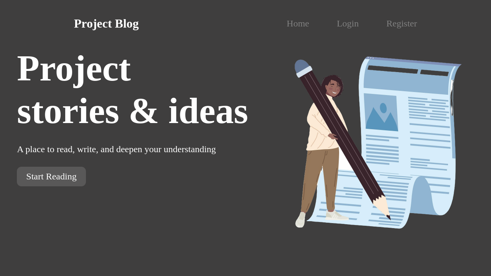

# Blog App - React & Vite

## Overview
This project is a simple blog application built using **React** and **Vite**. It currently focuses on the frontend functionality, with data stored locally in an array list. There is no server yet, but plans to integrate a backend will be implemented once the frontend is fully functional.

## Screenshot
#### Desktop


### Features:
- **User Authentication:** Login and Registration
- **Post Management:** 
  - Create a post
  - View others' posts
  - View and manage your own posts
- **Logout functionality**

## Technologies Used
- **React**: For building the user interface.
- **Vite**: For fast development and bundling.
- **CSS**: For styling the components.

## Project Setup

1. **Clone the repository**:
```bash
git clone https://github.com/Ngobe-Thabane/ProjectBlog.git
```

2. **Install dependencies**:
Run the following command to install the necessary packages:
```bash
npm install
```

3. **Start the development server**:
After installation, run the development server with:
```bash
npm run dev
```

This will start the app on `http://localhost:5173/` (or a different port, if specified).

4. **Open the app**:
Visit `http://localhost:5173/` to view and interact with the blog application.

## Current Features
- **Login:** Users can log in with their credentials (currently not persistent across sessions).
- **Registration:** Users can register a new account.
- **Post Creation:** Registered users can create new blog posts.
- **Post Viewing:** Users can view their own posts and posts created by others.
- **Logout:** Users can log out of the app, which will reset the session.

## Next Steps
- **Backend Implementation:** A backend will be added in the future to persist data (using a database and API).
- **Persistent Authentication:** Implement token-based authentication to persist user sessions.
- **Advanced Features:** Adding comment functionality, post editing, user profile management, and more.

## Contributions
Feel free to contribute to this project. Any improvements, bug fixes, or new features are welcome!

## License
This project is licensed under the MIT License. See the LICENSE file for more information.

---

**Enjoy using the Blog App!**
